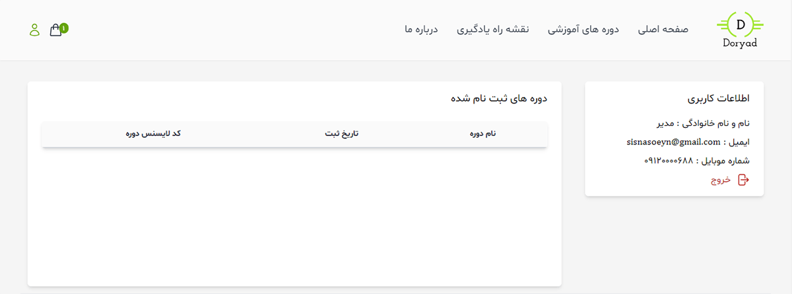
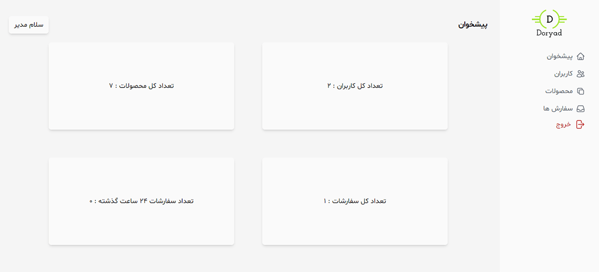

# Course Online Shop Frontend 🚀


Welcome to the **Course Online Shop Frontend** repository! This project powers the user interface of an online course marketplace, built with modern web technologies to provide a seamless and responsive experience. 🌐

## Table of Contents

- [Overview](#-overview)
- [Technologies Used](#%EF%B8%8F-technologies-used)
- [Getting Started](#-getting-started)
  - [Prerequisites](#prerequisites)
  - [Installation](#installation)
- [Usage](#-usage)
- [Screenshots](#-screenshots)
- [Related Repositories](#-related-repositories)
- [Contributing](#-contributing)
- [License](#-license)

## 📖 Overview

The frontend of the Course Online Shop is designed to deliver an intuitive and engaging interface for users to browse, purchase, and manage online courses. It communicates with the backend API to handle user interactions and data display.

## 🛠️ Technologies Used

- **React.js** ⚛️
- **Vite** ⚡
- **Tailwind CSS** 🎨
- **JavaScript** 💻
- **Axios** for API requests 🌍

## 🚀 Getting Started

This frontend requires a backend API to function. The recommended backend is the [Course Online Shop Backend](https://github.com/Sina-Ghiasi/course-online-shop-backend), which provides the necessary API endpoints for course data, user management, and orders. Follow the steps below to set up the frontend and ensure the backend is running.

### Prerequisites

- Node.js (v16 or higher) 📦
- npm or Yarn 🧶
- A running instance of the [Course Online Shop Backend](https://github.com/Sina-Ghiasi/course-online-shop-backend) 🛠️

### Installation

1. Clone the repository:

   ```bash
   git clone https://github.com/Sina-Ghiasi/course-online-shop-frontend.git
   ```

2. Navigate to the project directory:

   ```bash
   cd course-online-shop-frontend
   ```

3. Install dependencies:

   ```bash
   npm install
   ```

4. Create a `.env` file in the root directory and add the backend API URL (update the URL to match your backend's address):

   ```env
   VITE_API_URL=http://localhost:5000/api
   ```

5. Ensure the [Course Online Shop Backend](https://github.com/Sina-Ghiasi/course-online-shop-backend) is set up and running. Follow its setup instructions to start the backend server.

6. Start the development server:
   ```bash
   npm run dev
   ```

The app should now be running at `http://localhost:5173`. 🎉

## 📚 Usage

- Browse courses on the homepage 🏫
- Sign up or log in to access personalized features 🔐
- Add courses to your cart and proceed to checkout 🛒
- Access the admin panel to manage courses, users, and orders (available for authorized admin users) 🛠️

Note: The checkout bank process (payment gateway integration) is not currently developed; users are responsible for setting up their own payment processing solution 💳

## 📸 Screenshots

Below are some screenshots of the Course Online Shop frontend in action:

| Homepage                              | User profile                             | Admin panel                                 |
| ------------------------------------- | ---------------------------------------- | ------------------------------------------- |
|  |  |  |

## 🔗 Related Repositories

This frontend works in tandem with the backend API. Check out the related repository:

- [Course Online Shop Backend](https://github.com/Sina-Ghiasi/course-online-shop-backend) 🛠️

## 🤝 Contributing

We welcome contributions! Here's how you can help:

1. Fork the repository 🍴
2. Create a new branch:
   ```bash
   git checkout -b feature/your-feature
   ```
3. Commit your changes:
   ```bash
   git commit -m "Add your feature"
   ```
4. Push to the branch:
   ```bash
   git push origin feature/your-feature
   ```
5. Open a Pull Request 📬

## 📜 License

This project is licensed under the MIT License. See the [LICENSE](LICENSE) file for details.
